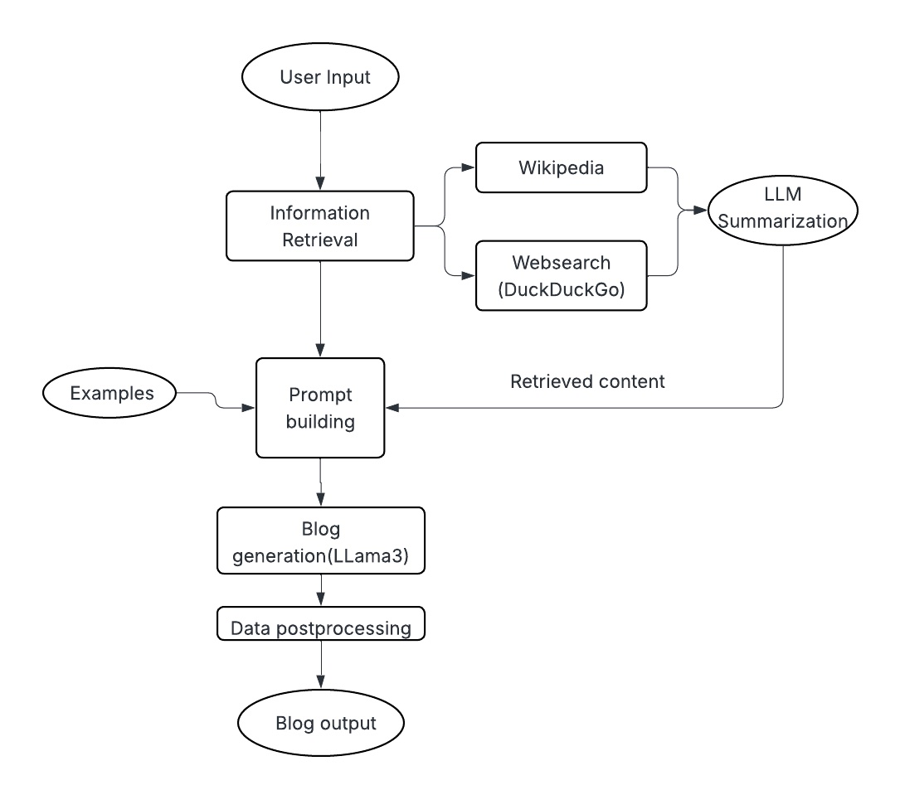

# **💬Blog_generation_system**

## Overview 
This project is an AI-powered automated blog generation system that takes a user-provided topic and generates high-quality, structured blog posts using LLaMA3-70B via Groq, LangChain agents, and external tools like Wikipedia and DuckDuckGo.It’s built for researchers, content creators, marketers, and educators who want quick, insightful blogs on any topic — powered by modern LLMs and real-time search.

## 📌Features

✦ 🔤 Generate blog posts for any given topic

✦ Uses powerful LLM: LLaMA3-70B via ChatGroq

✦ Real-time web search and Wikipedia summarization

✦ 📄 Output includes: Heading, Introduction, Content Sections, Challenges, Summary, References

✦ Modular codebase for easy customization and upgrades

✦ Ready for deployment with Streamlit or Flask (optional)

## Flowchart

## System workflow

## Demo Video
[ Click here to watch the demo](https://drive.google.com/file/d/1iFKv3WPuFu5PU2KD6VahZW_qJNY_bBAK/view?usp=sharing)

      
## 🔧 Installation & Setup

1. Clone the Repository

       git clone https://github.com/Anughna04/TubeTactix.ai.git
       cd TubeTactix.ai

2.Setup virtual environment
       
    # Create virtual environment
    python -m venv venv

    # Activate it (Windows)
    venv\Scripts\activate
    
    # OR activate it (macOS/Linux)
    source venv/bin/activate

3. Install Required Libraries

       pip install -r requirements.txt

4. Set up API keys

   ・Get your Groq API credentials to access LLaMA 3.

   ・Create a .env file in the project root and add:

       GROQ_API_KEY=your_groq_api_key_here

## Usage guidelines

1.Run main.py in the terminal
       
       python main.py

2.To get the blog,enter the required topic 

       Topic : your_required_topic

3. After collecting research by agentexecutot chain,blog with sections Header,Introduction,Content and Summary will be displayed as output

## Tools & Technologies Used

✦ Language Model :	LLaMA3-70B via ChatGroq
✦ 🔗 Orchestration : LangChain
✦ 🌐 Search Tools :	DuckDuckGo, Wikipedia API
✦ Programming Language :	Python
✦ Deployment	Optional: Streamlit / FastAPI

## Sample Input
     /Users/gayathrianughna/PycharmProjects/Blog_generator/venv/bin/python /Users/gayathrianughna/PycharmProjects/Blog_generator/main.py 
    💬 Enter a blog topic:
    ➡️ Topic: AI in healthcare

## Sample Output
    > Finished chain.
    
    ✍️ Generating blog...
    
    ✅ Blog generated successfully!
    
    📰 Blog Output:
    
    Here is the blog post based on the input:
    
    Revolutionizing Healthcare with AI:
    
    Introduction:
    The healthcare industry is on the cusp of a revolution, and Artificial Intelligence (AI) is at the forefront of this transformation. AI in healthcare has various applications, including diagnosis, treatment, and prediction of diseases, improving health outcomes, and lowering costs. 
    Content:
    The application of AI in healthcare is vast and diverse. One of the most significant applications is in medical diagnosis. AI-powered algorithms can analyze medical images, such as X-rays and MRIs, to identify abnormalities and diagnose diseases more accurately and quickly than human doctors. For instance, AI-powered systems have been shown to detect breast cancer from mammography images with a high degree of accuracy, outperforming human radiologists. (2)
    Another area where AI is making a significant impact is in personalized medicine. AI can analyze a patient's genetic data, medical history, and lifestyle to provide personalized treatment recommendations.
    Summary:
    In conclusion, AI in healthcare has the potential to revolutionize the industry, improving diagnosis, treatment, and patient care. From medical diagnosis to personalized medicine, AI is being applied in various ways to improve health outcomes and reduce costs.
    
    References:
    (1) Wikipedia. (2022). Artificial intelligence in healthcare. Retrieved from <https://en.wikipedia.org/wiki/Artificial_intelligence_in_healthcare    
    (3) DeepMind Health. (n.d.). About us. Retrieved from <https://health.google.com/>
    
    Source URLs:
    * https://en.wikipedia.org/wiki/Artificial_intelligence_in_healthcare
    * https://doi.org/10.1371/journal.pone.0176686

## Challenges Encountered

Prompt formatting to ensure logical blog flow and a well structured blog

Managing inconsistency in real-time web search results

## 💡Suggestions for Improvement

Add user options for tone and format (e.g., academic, casual)

Support for multilingual blog generation

Deploy via Flask + Docker for production

### 📧 For any queries, contact me at [anughnakandimalla11@gmail.com](anughnakandimalla11@gmail.com).

## 👩‍💻Author

Anughna
